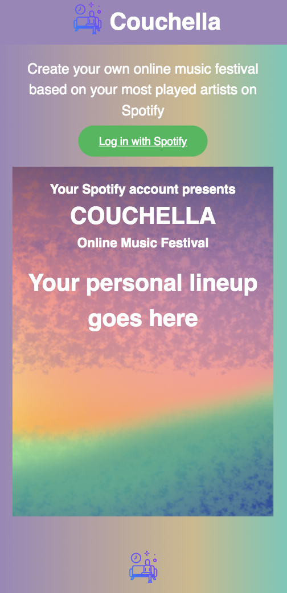

# Couchella

Users can create their ideal online music festival lineup poster and watch embedded videos of music concerts. This web app utilizes the Spotify API to attain the user’s most played artists and the Youtube API to display concert videos of those artists.

## Motivation

I love Spotify and I’m fascinated by their end of the year “Wrapped Statistics” that show you your most played artists, songs, podcasts, etc. of the year. Music artists have increasingly been performing live on Youtube or have released past concert videos due to quarantine. Inspired by the Coachella music festival aesthetic, I created Couchella: the personal online music festival experience.

## Built With:

- HTML, CSS, Javascript and JQuery

## Initial Wireframes:

- [Couchella Wirefreame](https://drive.google.com/file/d/1nfSrB5rBAZPYpeEGhOhjQHReCrgew3QT/view?usp=sharing)

## Screenshots

- Login Screen/Landing Page:
  

- Edit Artists Page:
  

- Music Festival Lineup Poster Page/ Embedded Youtube Concert Videos:
  
  

## Features

- Attain your 12 most played artists on Spotify
- Edit the list of artists you want displayed on the music festival lineup poster
- See final music festival lineup poster and concert videos of the artists

## Demo

- [Live Demo](https://marfriaz.github.io/couchella/)
